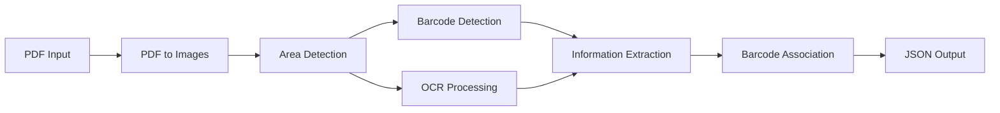

# Job Card Extractor

> Turn scanned job cards into structured data — no manual data entry required.

A Python CLI tool that reads manufacturing job card PDFs and automatically extracts job numbers, quantities, delivery dates, and operation lists into structured JSON. It combines computer vision (OpenCV), optical character recognition (EasyOCR), and barcode scanning (PyZbar) to parse even low-quality scans, matching each operation to its corresponding barcode through a multi-strategy association algorithm. Designed for the [COGNIMAN](https://cognimaneu.github.io/cogniman-website/) manufacturing digitization pipeline (Pilot 03).

**Version: 1.1.0** | [License: MIT](LICENSE)

## Quick Start

```bash
# One-liner install (macOS/Linux)
curl -sSL https://raw.githubusercontent.com/COGNIMANEU/pilot03-service-job-card-extractor/main/install.sh | bash

# Windows (PowerShell)
irm https://raw.githubusercontent.com/COGNIMANEU/pilot03-service-job-card-extractor/main/install.ps1 | iex

# Process a PDF
source ~/.venv/job-card-extractor/bin/activate
python job_card_extractor.py samples/example-01.pdf -o output
```

## How It Works



The tool converts PDF pages to images, detects document areas via horizontal line detection, then runs barcode scanning and OCR in parallel on each area. Extracted text is parsed with regex patterns to identify job numbers, quantities, delivery dates, and operations. Finally, operations are matched to barcodes using a hierarchical strategy. See [Architecture](docs/architecture.md) for details.

## Features

- **PDF Processing** - Multi-page handling with parallel processing
- **Barcode Detection** - Multiple strategies for robust Code128/Code39/EAN/UPC reading
- **OCR Text Extraction** - EasyOCR with preprocessing, caching, and multi-language support
- **Job Extraction** - Identifies job numbers, quantities, and delivery dates
- **Operation Recognition** - Extracts operations with confidence scores and barcode association
- **Visual Debugging** - Annotated images showing detected regions and barcodes
- **Logging & Metrics** - Detailed extraction logs with performance and quality metrics

## Usage

### CLI

```bash
# Basic usage
python job_card_extractor.py input.pdf -o output_dir

# Multi-language OCR
python job_card_extractor.py input.pdf -l en fr

# Fast processing (quality tradeoff)
python job_card_extractor.py input.pdf -o output --fast-mode

# Minimal output (skip debug files)
python job_card_extractor.py input.pdf -o output --no-raw --no-annotated
```

See [User Guide](docs/user-guide.md) for all options and examples.

### Programmatic

```python
from job_card_extractor import process_pdf_document

result = process_pdf_document(
    pdf_path='input.pdf',
    output_dir='output',
    lang_list=['en']
)

print(f"Job: {result['job_number']}")
for op in result['operations']:
    print(f"  Op {op['op_number']}: {op['op_name']}")
```

See [API Reference](docs/api-reference.md) for the full interface.

## Output

The tool generates structured JSON with extraction metadata:

```
output_dir/
├── {filename}_job_and_operations.json   # Main result
├── {filename}_raw.json                  # Raw data (optional)
├── extraction_process_*.log             # Processing log
└── annotated/                           # Debug images (optional)
```

See [User Guide - Output Structure](docs/user-guide.md#output-structure) for format details.

## Documentation

| Document | Description |
|----------|-------------|
| [User Guide](docs/user-guide.md) | CLI usage, options, output format |
| [API Reference](docs/api-reference.md) | Programmatic interface and data structures |
| [Architecture](docs/architecture.md) | Processing pipeline, strategies, performance |
| [Development](docs/development.md) | Local setup, testing, contributing |
| [Troubleshooting](docs/troubleshooting.md) | Common issues and solutions |

## Prerequisites

- Python 3.6+
- Poppler (`brew install poppler` on macOS, `apt-get install poppler-utils` on Linux)

## License

MIT
