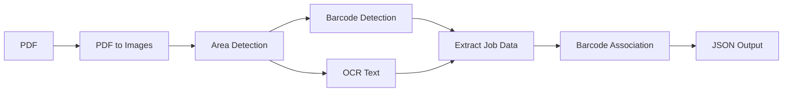

# Extract job data from scanned job cards automatically

Manually typing job numbers, quantities, and operations from paper job cards is slow and error-prone. Job Card Extractor uses OCR and barcode detection to read manufacturing job card PDFs and output structured JSON in seconds.

[Installation](#installation) | [When to Use](#when-to-use) | [Quick Start](#quick-start)

---

## When to Use

Use this tool when you need to:

| Scenario | What you get |
|---|---|
| Digitize paper job cards | Extract job number, quantity, delivery date, and operations into JSON |
| Batch process multiple cards | Run on multiple PDFs to build a database of job records |
| Automate data entry | Integrate into your workflow via Python API |
| Debug extraction quality | View annotated images showing detected regions and barcodes |

**Not suitable for:** Non-manufacturing documents, forms without job card structure, or password-protected PDFs.

---

## Installation

### 1. Install system dependency (Poppler)

```bash
# macOS
brew install poppler
```

```bash
# Linux (Ubuntu/Debian)
apt-get install poppler-utils
```

Windows: Download from https://github.com/oschwartz10612/poppler-windows/releases/

### 2. Clone and set up Python environment

```bash
git clone https://github.com/COGNIMANEU/pilot03-service-job-card-extractor
```

```bash
cd pilot03-service-job-card-extractor
```

```bash
python -m venv .venv
```

```bash
source .venv/bin/activate
```

```bash
pip install -r requirements.txt
```

First run downloads EasyOCR language models (~100MB). Ensure internet connectivity.

### 3. Verify installation

```bash
python job_card_extractor.py --version
```

---

## Quick Start

Process a job card PDF and get structured output:

```bash
python job_card_extractor.py samples/example-01.pdf -o output
```

Output:

```text
output/
├── example-01_job_and_operations.json   # Main result
└── annotated/                           # Debug images (optional)
```

JSON output structure:

```json
{
  "job_number": "J123456",
  "quantity": "100",
  "delivery_date": "15/06/2025",
  "operations": [
    {"op_number": "10", "op_name": "CUTTING", "confidence": 1.5},
    {"op_number": "20", "op_name": "ASSEMBLY", "confidence": 1.3}
  ]
}
```

---

## Common Options

Multi-language OCR (for non-English documents):

```bash
python job_card_extractor.py input.pdf -l en fr
```

Fast mode (30% faster, lower quality):

```bash
python job_card_extractor.py input.pdf -o output --fast-mode
```

Minimal output (skip debug files):

```bash
python job_card_extractor.py input.pdf -o output --no-raw --no-annotated
```

Disable parallel processing (lower memory):

```bash
python job_card_extractor.py input.pdf -o output --no-parallel
```

See [User Guide](docs/user-guide.md) for all options.

---

## Programmatic Use

```python
from job_card_extractor import process_pdf_document

result = process_pdf_document(
    pdf_path='input.pdf',
    output_dir='output',
    lang_list=['en']
)

print(f"Job: {result['job_number']}")
for op in result['operations']:
    print(f"  Op {op['op_number']}: {op['op_name']}")
```

See [API Reference](docs/api-reference.md) for full interface.

---

## How It Works



See [Architecture](docs/architecture.md) for technical details.

---

## Documentation

| Document | Description |
|----------|-------------|
| [User Guide](docs/user-guide.md) | CLI options, output format |
| [API Reference](docs/api-reference.md) | Python interface |
| [Architecture](docs/architecture.md) | Pipeline, strategies, performance |
| [Troubleshooting](docs/troubleshooting.md) | Common issues |

---

<details>
<summary>Original README content (preserved)</summary>

## Features

- **PDF Processing** - Multi-page handling with parallel processing
- **Barcode Detection** - Multiple strategies for robust Code128/Code39/EAN/UPC reading
- **OCR Text Extraction** - EasyOCR with preprocessing, caching, and multi-language support
- **Job Extraction** - Identifies job numbers, quantities, and delivery dates
- **Operation Recognition** - Extracts operations with confidence scores and barcode association
- **Visual Debugging** - Annotated images showing detected regions and barcodes
- **Logging & Metrics** - Detailed extraction logs with performance and quality metrics

## Prerequisites

- Python 3.6+
- Poppler

## License

MIT

</details>