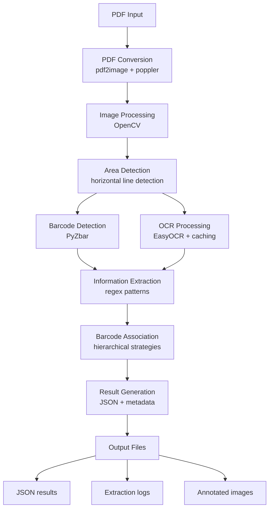
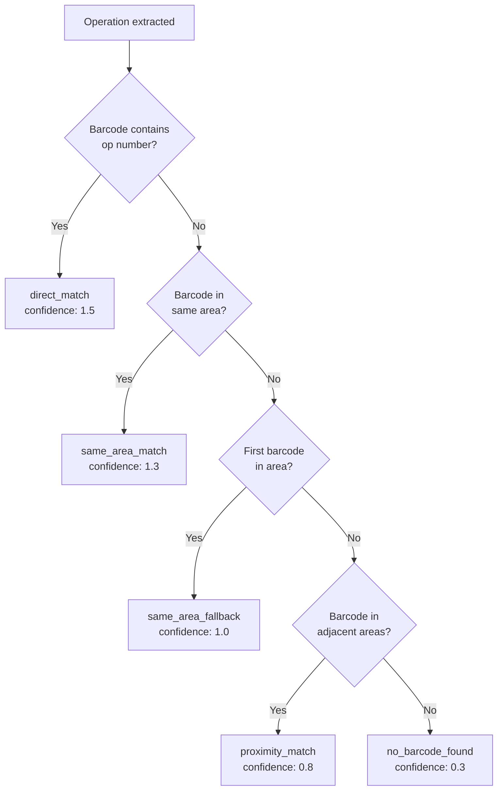

# Architecture

Technical overview of Job Card Extractor design and implementation.

## System Overview



## Processing Pipeline

### 1. PDF Conversion

- Converts multi-page PDFs to individual page images
- Uses `pdf2image` (requires poppler)
- Optional parallel processing for faster handling
- Resolution: 200 DPI (configurable)

### 2. Area Detection

Purpose: Divide page into logical document sections.

**Method:**
- Detect horizontal lines in image
- Lines represent section boundaries
- Create rectangular areas between lines
- Store area coordinates for subsequent processing

**Rationale:** Manufacturing job cards typically have horizontal dividers separating operations.

### 3. Barcode Detection

Detects barcodes in each document area.

**Detection Methods:**
- PyZbar (primary decoder)
- Multiple scan attempts with different preprocessing
- Supports Code128, Code39, EAN, UPC, and other formats

**Confidence Scoring:**
- Barcodes read successfully: confidence = 1.0
- Partial reads or uncertain detections: lower confidence
- Used in metadata for quality assessment

### 4. OCR Processing

Extracts text from document areas using EasyOCR.

**Optimization Features:**
- **Image Preprocessing** - Contrast enhancement, deskewing, noise reduction, thresholding
- **Caching** - Session-level cache reduces redundant processing
- **Language Support** - Configurable language models, multi-language support

**Quality Enhancement:**
- Applied by default (disable with `--fast-mode`)
- Includes image resizing and adaptive thresholding
- Performance tradeoff: ~30% slower but higher quality

### 5. Information Extraction

Uses regex patterns to extract structured data from OCR text.

#### Job Number Extraction

**Patterns Matched:**
- Header text containing "J" followed by digits
- Typical format: `J123456`
- Extracted from first page header

#### Quantity Extraction

**Patterns Matched:**
- "Quantity: XXX"
- "QTY: XXX"
- "Qty: XXX"
- Typically in document header

#### Delivery Date Extraction

**Patterns Matched:**
- "Delivery Date: DD/MM/YYYY"
- "Date Required: DD-MMM-YYYY"
- "Due Date: MM/DD/YYYY"
- Various date formats supported

#### Operation Extraction

**Patterns Matched:**
1. `^(\d+(?:\.\d+)?)\s+(.+?)(?:\s*(?:Scan|~)|$)` -- Direct format
2. `^(?:Operation\s+)?(\d+(?:\.\d+)?)\s*[\n\r]+\s*(.+?)(?:\n|$)` -- Multi-line format
3. Additional patterns for variant layouts

**Extracted Fields:**
- `op_number` -- Operation identifier
- `op_name` -- Operation description
- `op_id` -- Composite ID (job_number + operation_number)

### 6. Barcode Association

Matches extracted operations with detected barcodes using hierarchical strategies.



**Strategy Hierarchy:**

| Priority | Strategy | Confidence | Description |
|----------|----------|-----------|-------------|
| 1 | `direct_match` | 1.5 | Barcode contains operation number directly |
| 2 | `same_area_match` | 1.3 | Barcode in same document area as operation |
| 3 | `same_area_fallback` | 1.0 | First barcode found in operation's area |
| 4 | `proximity_match` | 0.8 | Barcode in adjacent areas (+-2 areas) |
| 5 | `no_barcode_found` | 0.3 | No associated barcode found |

### 7. Logging System

**Unified Log File:**
- Single log per extraction
- Timestamped entries in ISO 8601 format

**Log Prefixes:**
- `[MAIN]` -- General process information
- `[OP-XX]` -- Operation-specific details (XX = operation number)

**Logged Information:**
- Process start/end times
- PDF conversion progress
- Area detection results
- Barcode detection attempts
- OCR text samples
- Extraction confidence scores
- Performance metrics

### 8. Metadata Collection

Detailed metrics for benchmarking and quality assessment.

**extraction_info:**
- Version and timestamp
- Processing settings used
- Performance metrics (ops/sec, areas/sec)

**document_info:**
- Page count
- Area count
- Total processing time

**operation_statistics:**
- Total operations found
- Operations with barcodes
- Success rate percentage
- Confidence score distribution

**quality_metrics:**
- Average OCR confidence
- Barcode detection rate
- Pattern match success rate

## Performance Characteristics

### Processing Time Factors

- **PDF size:** Linear with page count
- **Page resolution:** Quadratic impact
- **OCR languages:** Linear per language
- **Parallel processing:** ~3-4x speedup (multi-core systems)
- **Quality enhancement:** ~30% slowdown

### Memory Usage

- **Base:** ~200MB
- **Per page:** ~50-100MB (depends on image size)
- **OCR models:** ~800MB-1.2GB (cached after first run)
- **Parallel processing:** Multiplies memory per process

### Optimization Strategies

1. **Fast mode** (`--fast-mode`) - Disables quality enhancement, ~30% faster
2. **Parallel processing** (default) - 3-4x speedup on multi-core systems
3. **Language limiting** (`-l en`) - Use only required languages
4. **Selective output** (`--no-annotated --no-raw`) - Saves disk I/O

## Data Structures

### Operation Object

```python
{
    "op_number": str,           # "10", "20.1", etc.
    "op_name": str,             # "CUTTING", "ASSEMBLY", etc.
    "op_id": str,               # Composite: "J123456Q10"
    "page": int,                # 1-indexed page number
    "confidence": float,        # Barcode match confidence
    "extraction_strategy": str, # Strategy used for matching
    "pattern_matched": str      # Regex pattern that matched
}
```

### Result Object

```python
{
    "job_number": str,
    "quantity": str,
    "delivery_date": str,
    "operations": List[Operation],
    "extraction_metadata": {
        "extraction_info": {...},
        "document_info": {...},
        "operation_statistics": {...},
        "quality_metrics": {...}
    }
}
```

## Error Handling

### Recoverable Errors

- Missing system dependencies -> Clear error message
- Corrupted PDF pages -> Skipped, extraction continues
- OCR timeouts -> Fallback to faster method
- Barcode read failures -> Logged, operation continues

### Logging

All errors and warnings logged with full context:
- Error type and message
- Affected document/page/operation
- Suggested resolution

## Caching

### Session-Level Cache

- EasyOCR model cache: `~/.EasyOCR/`
- Operation result cache: In-memory during session
- Barcode detection cache: Per-page, session lifetime

### Benefits

- Faster processing for repeated documents
- Reduced network requests for model downloads
- Lower CPU usage for duplicate operations

## Extensibility

### Adding New Pattern Types

Extend `_extract_operations()` in `job_card_extractor.py`:

1. Define new regex pattern
2. Add matching strategy
3. Test with sample documents
4. Update logging and metadata

### Barcode Format Support

PyZbar supports 30+ formats. Configuration in barcode detection section.

### Language Support

Add language codes to `-l` option. EasyOCR supports 80+ languages.

## Dependencies

| Package | Purpose | Version |
|---------|---------|---------|
| opencv-python | Image processing | 4.5+ |
| pdf2image | PDF conversion | 1.16+ |
| EasyOCR | Text extraction | 1.6+ |
| pyzbar | Barcode detection | 0.1.8+ |
| numpy | Numerical operations | 1.20+ |
| Pillow | Image operations | 8.0+ |

System: poppler (PDF conversion backend)

---

See also: [User Guide](user-guide.md) | [API Reference](api-reference.md) | [Development](development.md) | [Troubleshooting](troubleshooting.md)
